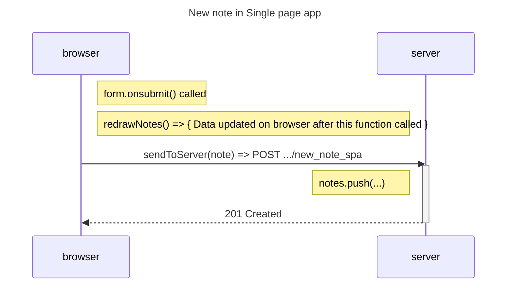

```mermaid
%%{init: { 'sequence': {'noteAlign': 'left'}}}%%
sequenceDiagram
    title New note in Single page app
    %% autonumber
    participant browser
    participant server

    Note right of browser: form.onsubmit() called
    Note right of browser: redrawNotes() => { Data updated on browser after this function called }
    browser->>server: sendToServer(note) => POST .../new_note_spa
    activate server
    Note left of server: notes.push(...)
    server-->>browser: 201 Created
    deactivate server
```